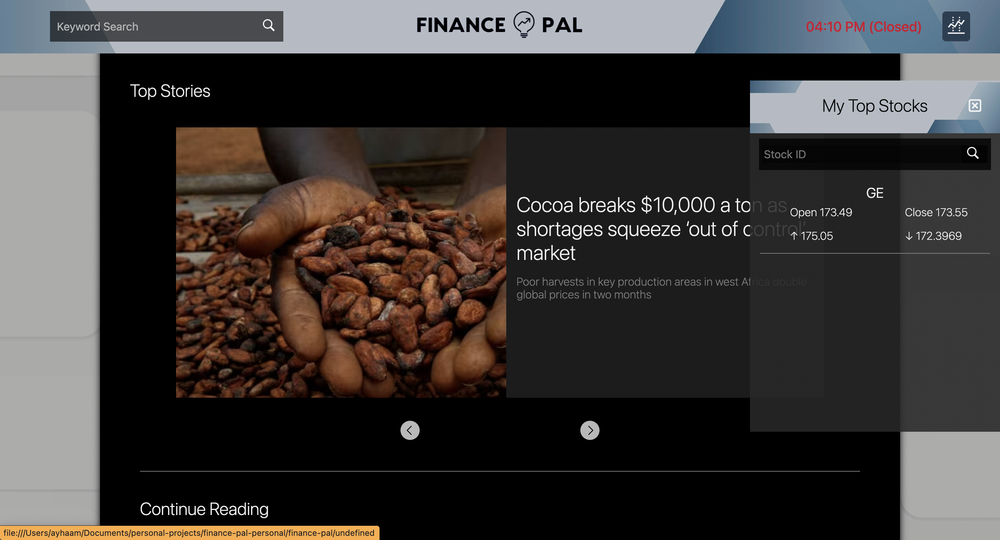

# finance-update-app
Your hub for finance news and updates!

## Description
Load up the page and the main are consisits of the top news stories right now, all the stories are clickable links that will lead you directly to the article. 

On the right side of the screen is a collapsible sidebar where you can search for your favourite stocks, and it returns the price information from the previous trading day. 

The header has a live time that will light up green when the stock market is open and orange-red when it is closed. There is also a search bar on the top left side where you can input a keyword and it will direct you to detailed search results.

## Executing program
Website link: https://ayhaamb.github.io/finance-pal/

## Photo of deployed website

## Help
Any advice for common problems or issues, email me at ayh132@gmail.com

## Authors
Ayhaam Baksh